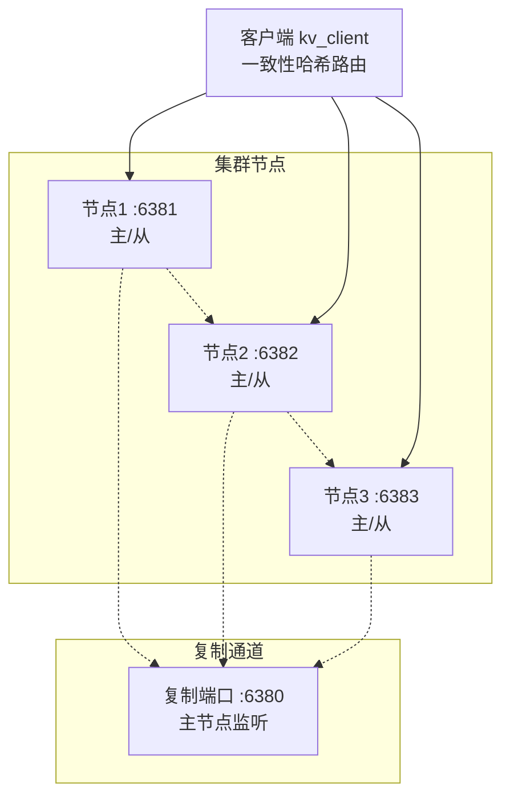

# distributed-kv-store
《分布式键值存储系统》

一个从零实现的轻量级分布式键值存储系统，支持数据分片、主从复制和手动故障切换。

## 项目状态

| 阶段 | 功能 | 状态 |
|------|------|------|
| 阶段一 | 单机KV存储 | ✅ 完成 |
| 阶段二 | 分布式分片 | ✅ 完成 |
| 阶段三 | 主从复制 | ✅ 完成 |
| 阶段四 | 手动故障切换 | ✅ 完成 |

## 快速开始

### 编译

```bash
git clone https://github.com/Pochmi/distributed-kv-store.git
cd distributed-kv-store
mkdir build && cd build
cmake .. && make -j4
```
## （一）单机kv
```bash
# 启动服务器
./bin/kv_server --port 6381

# 客户端操作
./bin/kv_client set name "张三"
./bin/kv_client get name
```
## （二）分布式分片
```
# 启动3个分片节点
./bin/kv_server --port 6381 --cluster &
./bin/kv_server --port 6382 --cluster &
./bin/kv_server --port 6383 --cluster &

# 客户端自动路由
./bin/kv_client set user:1001 "data"
```
## （三）主从复制
```
# 主节点 (服务端口6381, 复制端口6380)
./bin/kv_server --port 6381 --role master --replication

# 从节点
./bin/kv_server --port 6382 --role slave --master 127.0.0.1:6380 --replication

# 写入主节点
./bin/kv_client set name "张三"

# 从从节点读取
echo "GET name" | nc 127.0.0.1 6382
```
## （四）集群模式（心跳检测 + 手动故障切换）
```
# 启动主节点
./bin/kv_server --port 6381 --role master --replication --cluster

# 启动从节点
./bin/kv_server --port 6382 --role slave --master 127.0.0.1:6380 --replication --cluster

# 查看集群状态
echo "ADMIN_STATUS" | nc 127.0.0.1 6381

# 手动故障切换
echo "ADMIN_FAILOVER node_6382" | nc 127.0.0.1 6381

```
## 命令参考
### 客户端命令
| 命令 | 格式 | 示例 |
|------|------|------|
| SET | set <key> <value> | set name "张三" |
| GET | get <key> | get name |
| DEL | del <key> | del name |

### 管理命令（通过 nc 发送）

| 命令 | 说明 | 示例 |
|------|------|------|
| `ADMIN_STATUS` | 查看集群状态 | `echo "ADMIN_STATUS" \| nc 127.0.0.1 6381` |
| `ADMIN_FAILOVER <node>` | 手动切换到指定节点 | `echo "ADMIN_FAILOVER node_6382" \| nc 127.0.0.1 6381` |
| `ADMIN_HELP` | 查看帮助 | `echo "ADMIN_HELP" \| nc 127.0.0.1 6381` |

## 架构设计

## 技术栈

| 技术 | 用途 |
|------|------|
| C++14 | 核心语言 |
| epoll | 高并发网络模型 |
| pthread | 多线程处理 |
| Socket | TCP/UDP 通信 |
| CMake | 构建系统 |

## 性能指标

| 指标 | 数值 |
|------|------|
| 单节点 QPS | 1000+ |
| 并发连接 | 100+ |
| 复制延迟 | < 100ms |
| 故障切换时间 | < 3s |

## 项目结构
```
src/
├── client/ # 客户端（路由、集群配置）
├── common/ # 公共组件（日志、协议、工具）
├── core/ # 存储引擎（内存KV）
├── network/ # 网络层（Reactor服务器）
├── replication/ # 复制模块（主从复制）
└── cluster/ # 集群管理（心跳、故障切换）
```

## 快速脚本测试

```bash
# 阶段一测试
./tests/phase1/quick_test.sh

# 阶段二测试
./tests/phase2/quick_test.sh

# 阶段三测试
./tests/phase3/quick_test.sh

# 阶段四测试
./tests/phase4/test_manual_failover.sh
```
## 作者
GitHub: @Pochmi
邮箱：wangshuo0422@outlook.com

## 许可证
MIT License
